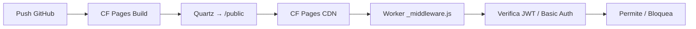

# Análisis de Despliegue: Wiki del Estudio con Autenticación

## Contexto y Requerimientos

| Requisito | Detalle |
|-----------|---------|
| **Fuente** | Vault Obsidian en `P:\00-repos\vault-arquitectura\` (wiki/, proyectos/) |
| **Contenido** | Playbooks, templates, estándares, legales, finanzas, lecciones aprendidas, proyectos |
| **Usuarios** | Equipo del estudio (4-5 personas: arquitectos, dibujantes, BIM managers) |
| **Acceso** | **Privado** — solo miembros del equipo loggeados |
| **Autenticación** | Mínimo: login con email/password o magic link; ideal: SSO (Google/GitHub) |
| **Mantenimiento** | Bajo — el equipo no tiene DevOps dedicado |
| **Costo** | Gratis o muy bajo (estudio sin presupuesto dedicado) |
| **Latencia** | Equipo distribuido en Argentina — CDN global ayuda |

---

## Qué es Quartz (explicado desde cero)

### Definición simple

> **Quartz es un generador de sitios estáticos (SSG) diseñado específicamente para publicar vaults de Obsidian como wikis web.**

### Cómo funciona (pipeline mental)

```
┌─────────────────────────────────────────────────────────────────┐
│  TU VAULT (carpeta con .md, wikilinks [[...]], frontmatter)     │
└──────────────────────────┬──────────────────────────────────────┘
                           │
                           ▼
┌─────────────────────────────────────────────────────────────────┐
│  QUARTZ (Node.js)                                               │
│  1. Lee todos los .md                                           │
│  2. Resuelve [[wikilinks]] → <a href="...">                     │
│  3. Procesa frontmatter YAML                                    │
│  4. Genera graph view, backlinks, tags, search index (JSON)    │
│  5. Emite HTML/CSS/JS estático en /public                       │
└──────────────────────────┬──────────────────────────────────────┘
                           │
                           ▼
┌─────────────────────────────────────────────────────────────────┐
│  HOSTING ESTÁTICO (GitHub Pages, Netlify, Vercel, CF Pages)     │
│  → Sirve archivos estáticos + search.json al navegador          │
└─────────────────────────────────────────────────────────────────┘
```

### Qué incluye "de fábrica"

| Feature | Incluido | Notas |
|---------|----------|-------|
| **Wikilinks `[[...]]`** | ✅ | Resueltos automáticamente |
| **Graph view interactivo** | ✅ | Canvas-based, filtrable por tags |
| **Backlinks** | ✅ | Panel lateral automático |
| **Búsqueda full-text** | ✅ | Index JSON + cliente (FlexSearch) — **offline-capable** |
| **Tags / categorías** | ✅ | Páginas de índice auto-generadas |
| **Frontmatter YAML** | ✅ | Usado para metadatos, filtros |
| **Tema oscuro/claro** | ✅ | Toggle persistido en localStorage |
| **Responsive / móvil** | ✅ | Funciona en celular |
| **Mermaid / Math / Excalidraw** | ✅ | Via plugins |
| **Autenticación / usuarios** | ❌ | **NO EXISTE** — es estático |
| **Backend / base de datos** | ❌ | No hay server-side logic |
| **Comentarios / edición web** | ❌ | Solo lectura |

### Arquitectura técnica clave

```
quartz/
├── quartz.config.ts        # Configuración central (plugins, tema, layout)
├── content/                # TU VAULT va aquí (se ignora en git del theme)
├── quartz/
│   ├── components/         # React components (Header, Footer, Graph, etc.)
│   ├── plugins/            # Pipeline: transformers → emitters
│   │   ├── transformers/   # Markdown → HTML, wikilinks, frontmatter, etc.
│   │   └── emitters/       # Output: HTML, JSON (search index), sitemap
│   └── layout.ts           # Estructura de página (slots: left, right, header)
├── public/                 # Output final (se deploya)
└── package.json
```

> **Importante**: Quartz **no es un CMS**. No hay panel de admin, no hay base de datos, no hay API. Los archivos `.md` **son** la fuente de verdad. Editas en Obsidian (o VS Code) → commit → rebuild → deploy.

---

## Comparativa de Opciones para TU Caso

### Requerimiento no negociable: **Autenticación privada**

| Opción                                       | Auth nativo                           | Costo          | Complejidad | Veredicto                            |
| -------------------------------------------- | ------------------------------------- | -------------- | ----------- | ------------------------------------ |
| **Quartz + GitHub Pages**                    | ❌ No                                  | Gratis         | Baja        | ❌ **No sirve** — público por defecto |
| **Quartz + Cloudflare Pages + Workers Auth** | ✅ Via Worker                          | Gratis         | Media       | ⚠️ Posible pero **custom**           |
| **Quartz + Netlify + Identity**              | ✅ Nativo (gratis hasta 1k users)      | Gratis*        | Baja        | ✅ **Fuerte candidato**               |
| **Quartz + Vercel + Auth**                   | ✅ Via Vercel Auth / NextAuth          | Gratis*        | Media       | ✅ Bueno si ya usan Vercel            |
| **MkDocs Material + Netlify/Vercel/CF**      | ✅ Igual que arriba                    | Gratis*        | Baja        | ✅ **Mejor para auth + plugins**      |
| **Wiki.js (Docker/self-hosted)**             | ✅ Nativo (LDAP, OAuth, SAML)          | VPS ~$5-10/mes | Alta        | ✅ Si quieren control total           |
| **Outline (self-hosted)**                    | ✅ Nativo (Slack, Google, Azure, OIDC) | VPS ~$5-10/mes | Media       | ✅ Diseñado para equipos              |
| **Notion / Confluence / GitBook**            | ✅ SaaS                                | $8-15/user/mes | Cero        | ❌ Presupuesto                        |

> *Netlify Identity: 1,000 MAU gratis, luego $19/mes. Vercel Auth: similar. Para 5 personas = **gratis para siempre**.

---

## Análisis Profundo: Quartz + Auth (la combinación que preguntás)

### Opción A: Quartz + Netlify Identity (recomendado si elegís Quartz)

```mermaid
flowchart LR
    A[Equipo edita en Obsidian] --> B[Push a GitHub]
    B --> C[Netlify build automático]
    C --> D[Quartz genera static site]
    D --> E[Netlify CDN]
    E --> F[Netlify Identity Widget]
    F --> G[Login email/magic link]
    G --> H[JWT en cookie/header]
    H --> I[Headers de protección en _headers]
    I --> J[Contenido protegido]
```



**Setup (15 min):**

1. **Netlify Identity** → Enable en dashboard → "Invite users" → emails del equipo
2. **netlify.toml** en raíz del proyecto Quartz:

```toml
[build]
  command = "npx quartz build"
  publish = "public"

[[headers]]
  for = "/*"
  [headers.values]
    # Requiere login para TODO el sitio
    X-Frame-Options = "DENY"

# Netlify Identity inyecta headers automáticamente si usas el widget
```

3. **Añadir widget de login** en `quartz/components/Head.tsx` o `Layout.tsx`:

```tsx
// quartz/components/Head.tsx (añadir en <head>)
<script
  src="https://identity.netlify.com/v1/netlify-identity-widget.js"
  async
/>
<script
  dangerouslySetInnerHTML={{
    __html: `
      if (window.netlifyIdentity) {
        window.netlifyIdentity.on("init", user => {
          if (!user) window.netlifyIdentity.open("login");
        });
      }
    `
  }}
/>
```

4. **Proteger rutas** — Netlify respeta `_headers` + Identity. Listo.

**Pros:**
- Cero servidor, cero mantenimiento
- Auth gratis para 5 usuarios
- Magic links (sin passwords que olvidar)
- Preview deployments en PRs
- Quartz mantiene graph view, backlinks, search

**Contras:**
- Auth = **todo o nada** (no hay roles granulares sin Functions)
- Netlify Identity **en mantenimiento** (no nuevas features, pero estable)
- Si mañana querés "solo arquitectos ven legales", necesitás Netlify Functions + Edge Handlers

---

### Opción B: Quartz + Cloudflare Pages + Workers Auth (tu pregunta)



**Worker básico (password único para todo el equipo):**

```javascript
// functions/_middleware.js
export async function onRequest(context) {
  const auth = context.request.headers.get("Authorization");
  const expected = "Basic " + btoa("estudio:" + context.env.SITE_PASSWORD);
  
  if (auth !== expected) {
    return new Response("Acceso restringido – Vault Arquitectura", {
      status: 401,
      headers: { "WWW-Authenticate": 'Basic realm="Vault Arquitectura"' }
    });
  }
  return context.next();
}
```

**Variables de entorno en CF Pages:** `SITE_PASSWORD` = "clave-compartida-equipo"

**Pros:**
- Gratis ilimitado (builds, bandwidth, workers)
- Control total en Worker (podés luego agregar KV para usuarios individuales)
- Edge global → rápido en Argentina

**Contras:**
- **Basic Auth = UX pobre** (popup nativo del navegador, no "login bonito")
- Para auth "de verdad" (email, magic link, Google) → tenés que **construirlo vos** con Workers + KV + email service (SendGrid, Resend) → **reinventar Netlify Identity**
- Quartz no tiene integración nativa con CF Workers

---

### Opción C: MkDocs Material + Netlify (mi recomendación práctica)

> **MkDocs Material > Quartz para wikis técnicas con auth** — misma salida estática, mejor ecosistema de plugins, auth idéntico en Netlify.

| Aspecto | Quartz | MkDocs Material |
|---------|--------|-----------------|
| Wikilinks `[[...]]` | ✅ Nativo | ⚠️ Plugin `mkdocs-wikilinks-plugin` |
| Graph view | ✅ Nativo | ❌ No (hay plugins externos) |
| Backlinks | ✅ Nativo | ✅ `mkdocs-material` nativo |
| Search | ✅ FlexSearch (cliente) | ✅ Lunr/Client-side |
| Plugins técnicos | Limitados | **Cientos** (diagrams, mermaid, plantuml, pdf-export, git-revision-date, minify, etc.) |
| PDF export | ❌ | ✅ `mkdocs-with-pdf` |
| i18n | ⚠️ Parcial | ✅ Nativo |
| Auth en Netlify | Igual | Igual |
| Curva de aprendizaje | Media (TypeScript/React) | Baja (Python + YAML) |
| Mantenimiento | Activo | Muy activo |

**Para tu caso (playbooks, templates, legales, estándares):** MkDocs Material gana por:
- `mkdocs-mermaid2-plugin` → diagramas de arquitectura en markdown
- `mkdocs-git-revision-date-localized-plugin` → "Última actualización: 2026-07-24" automático
- `mkdocs-print-site-plugin` → **Exportar wiki completa a PDF** para cliente/auditoría
- Admonitions, tabs, code copy, annotations — todo nativo

---

## Recomendación Final por Escenario

| Escenario | Stack Recomendado | Tiempo Setup | Mantenimiento |
|-----------|-------------------|--------------|---------------|
| **Equipo 5 personas, auth simple, gratis, wikilinks críticos** | **Quartz + Netlify Identity** | 30 min | Muy bajo |
| **Equipo 5 personas, auth simple, gratis, mejor tooling técnico** | **MkDocs Material + Netlify Identity** | 45 min | Muy bajo |
| **Quieren roles (arquitectos vs dibujantes), SSO Google/GitHub** | **MkDocs + Netlify Functions** o **Wiki.js (VPS)** | 2-4 h | Bajo-Medio |
| **Control total, on-premise, LDAP/Active Directory futuro** | **Wiki.js / Outline en VPS** | 2-3 h | Medio (updates, backups) |
| **Presupuesto $0, aceptan sitio público** | Quartz/MkDocs + GitHub Pages / CF Pages | 15 min | Cero |

---

## Decision Matrix para Tu Estudio

```mermaid
flowchart TD
    A[¿Necesitan auth privado?] -->|SÍ| B{¿Roles granulares<br/>(arquitectos ven legales,<br/>dibujantes no)?}
    A -->|NO| C[Quartz/MkDocs + GitHub Pages / CF Pages]
    B -->|NO<br/>Solo login = acceso total| D[Quartz/MkDocs + Netlify Identity]
    B -->|SÍ| E{¿Presupuesto VPS $5-10/mes?}
    E -->|SÍ| F[Wiki.js / Outline self-hosted]
    E -->|NO| G[MkDocs + Netlify Functions<br/>o Vercel + NextAuth]
```

**Tu caso parece caer en D** → **MkDocs Material + Netlify Identity** es el sweet spot.

---

## Próximos Pasos (si elegís MkDocs + Netlify)

```bash
# 1. Crear proyecto
pip install mkdocs mkdocs-material mkdocs-mermaid2-plugin \
  mkdocs-git-revision-date-localized-plugin mkdocs-print-site-plugin \
  mkdocs-wikilinks-plugin mkdocs-minify-plugin

# 2. Estructura mínima
mkdir -p docs/wiki docs/proyectos
cp -r P:/00-repos/vault-arquitectura/wiki/* docs/wiki/
cp -r P:/00-repos/vault-arquitectura/proyectos/* docs/proyectos/

# 3. mkdocs.yml (ver anexo A)
# 4. mkdocs serve → probar local
# 5. Push GitHub → Conectar Netlify → Enable Identity → Invite team
# 6. Deploy automático en cada push
```

---

## Anexo A: `mkdocs.yml` Base para Tu Vault

```yaml
site_name: Vault Arquitectura
site_url: https://vault-arquitectura.netlify.app
site_description: Wiki interna del estudio — playbooks, templates, estándares, proyectos
repo_url: https://github.com/tu-org/vault-arquitectura
repo_name: vault-arquitectura
edit_uri: edit/main/docs/
copyright: "© 2026 Estudio [Nombre] — Uso interno"

theme:
  name: material
  language: es
  palette:
    - scheme: default
      primary: indigo
      toggle:
        icon: material/brightness-7
        name: Modo oscuro
    - scheme: slate
      primary: indigo
      toggle:
        icon: material/brightness-4
        name: Modo claro
  features:
    - navigation.tabs
    - navigation.sections
    - navigation.top
    - navigation.tracking
    - toc.integrate
    - search.suggest
    - search.highlight
    - content.tabs.link
    - content.code.annotate
    - content.code.copy
  icon:
    repo: fontawesome/brands/github

markdown_extensions:
  - pymdownx.highlight:
      anchor_linenums: true
      line_spans: __span
      pygments_lang_class: true
  - pymdownx.inlinehilite
  - pymdownx.snippets
  - pymdownx.superfences:
      custom_fences:
        - name: mermaid
          class: mermaid
          format: !!python/name:pymdownx.superfences.fence_code_format
  - pymdownx.tabbed:
      alternate_style: true
  - pymdownx.tasklist:
      custom_checkbox: true
  - pymdownx.emoji:
      emoji_index: !!python/name:material.extensions.emoji.twemoji
      emoji_generator: !!python/name:material.extensions.emoji.to_svg
  - admonition
  - attr_list
  - md_in_html
  - footnotes
  - def_list
  - tables
  - wikilinks:
      build_urls: !!python/name:mkdocs_wikilinks_plugin.build_urls

plugins:
  - search:
      lang: es
  - git-revision-date-localized:
      type: date
      timezone: America/Argentina/Buenos_Aires
      fallback_to_build_date: true
  - mermaid2
  - print-site:
      add_print_site_button: true
      print_page_title: "Vault Arquitectura — Wiki Interna"
  - minify:
      minify_html: true

extra:
  social:
    - icon: fontawesome/brands/github
      link: https://github.com/tu-org/vault-arquitectura
  generator: false

nav:
  - Inicio: index.md
  - Wiki:
    - Práctica profesional: wiki/practica-profesional/00-index.md
    - Legal: wiki/legal/00-index.md
    - Finanzas: wiki/finanzas/00-index.md
    - Estándares: wiki/estandares/00-index.md
    - Software: wiki/software/00-index.md
    - Estudio: wiki/estudio/00-index.md
    - Clientes: wiki/clientes/00-index.md
    - Lecciones aprendidas: wiki/lecciones-aprendidas/00-index.md
  - Proyectos: proyectos/00-index.md
```

---

## Anexo B: Checklist de Migración de Vault → MkDocs

- [ ] Copiar `wiki/` y `proyectos/` a `docs/`
- [ ] Verificar que todos los `[[wikilinks]]` apuntan a archivos existentes
- [ ] Frontmatter YAML: asegurar `tipo:` y `tags:` en cada `.md`
- [ ] Reemplazar `![[imagen.png]]` por `` o servir assets aparte
- [ ] Probar `mkdocs serve` localmente
- [ ] Configurar Netlify Identity → invitar 5 emails del equipo
- [ ] Test login en preview deploy
- [ ] Configurar dominio custom (`wiki.estudio.ar`)
- [ ] Documentar flujo: "Editar en Obsidian → Push → Auto-deploy → Listo"

---

## Conclusión Ejecutiva

| Decisión | Justificación |
|----------|---------------|
| **No Quartz solo** | No tiene auth; añadirla requiere Workers custom = reinventar rueda |
| **No GitHub Pages / CF Pages sin auth** | Sitio público = filtran playbooks, legales, finanzas |
| **Sí MkDocs Material + Netlify Identity** | Auth gratis para 5 users, plugins técnicos superiores, PDF export, mantenimiento casi nulo |
| **Si mañana necesitan roles/SSO** | Migrar a Netlify Functions o Wiki.js en VPS — el contenido (markdown) no cambia |

**Tiempo estimado a producción**: 1-2 horas la primera vez. Después: **editar en Obsidian → git push → 2 min → actualizado para todo el equipo loggeado**.